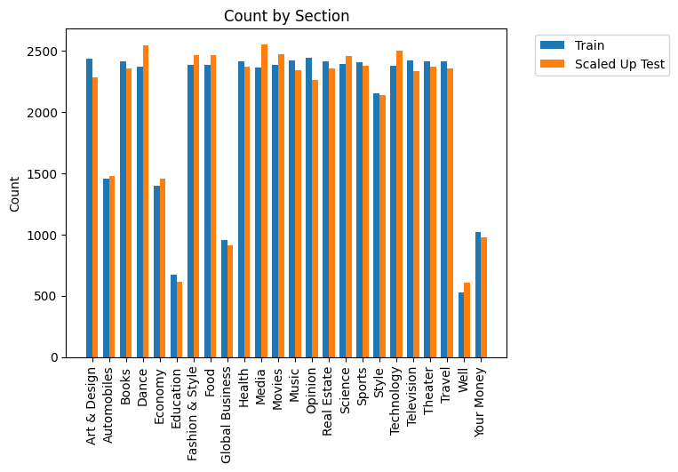
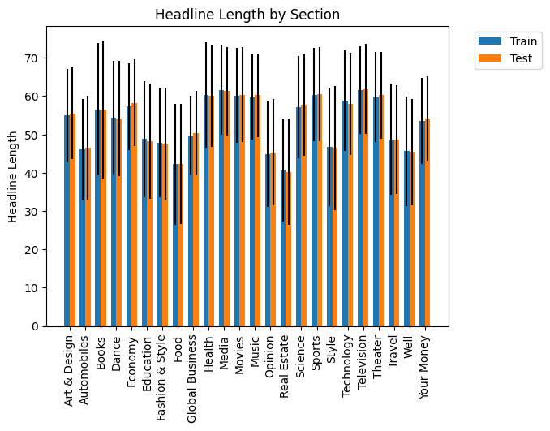
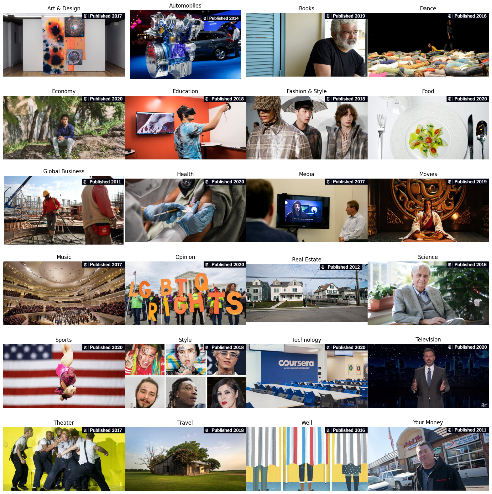
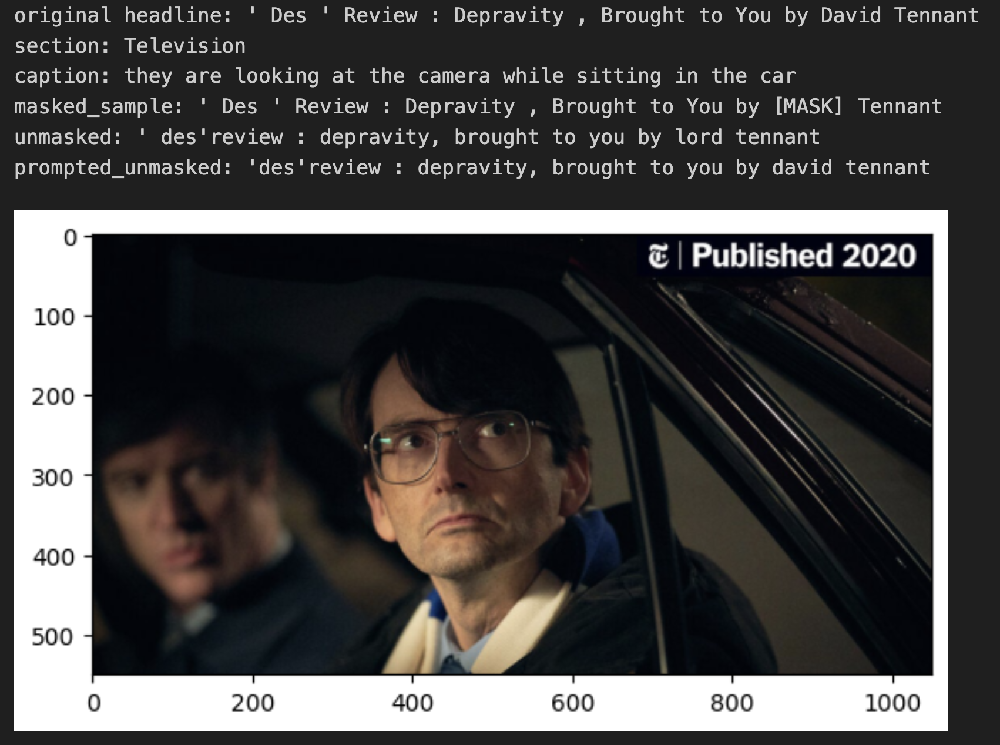
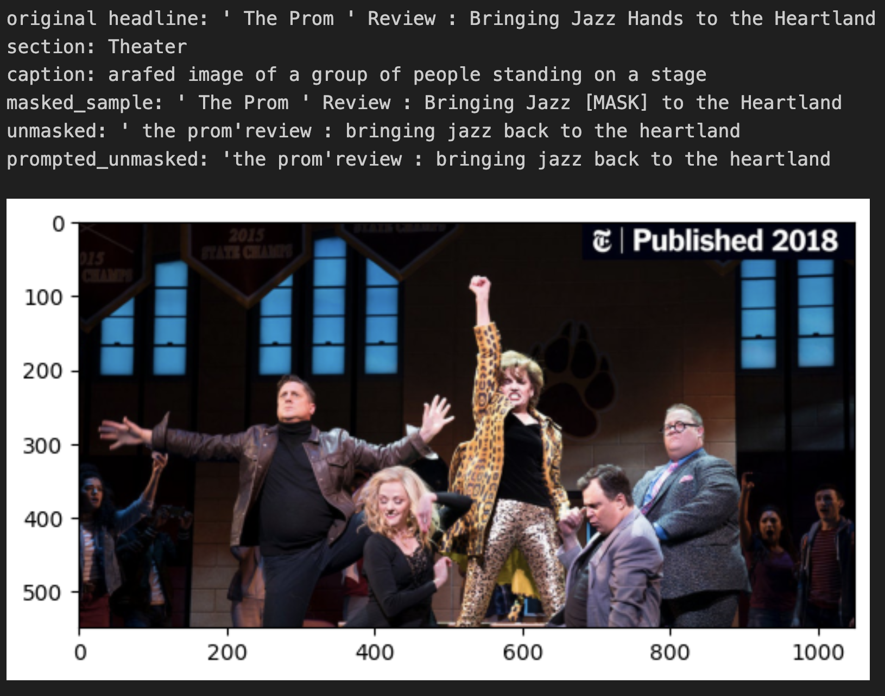
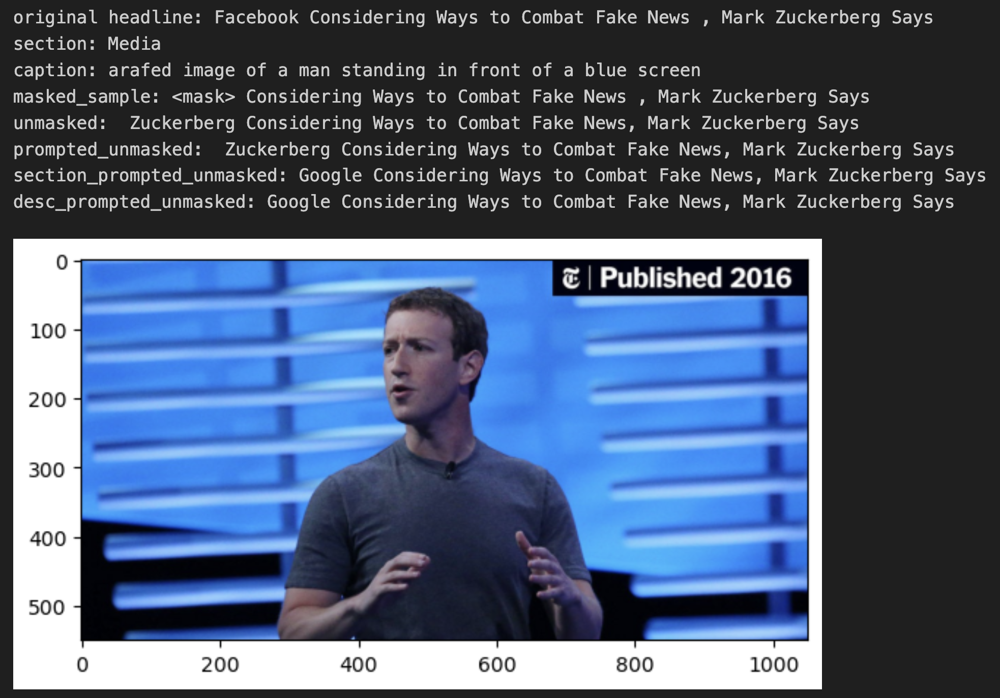
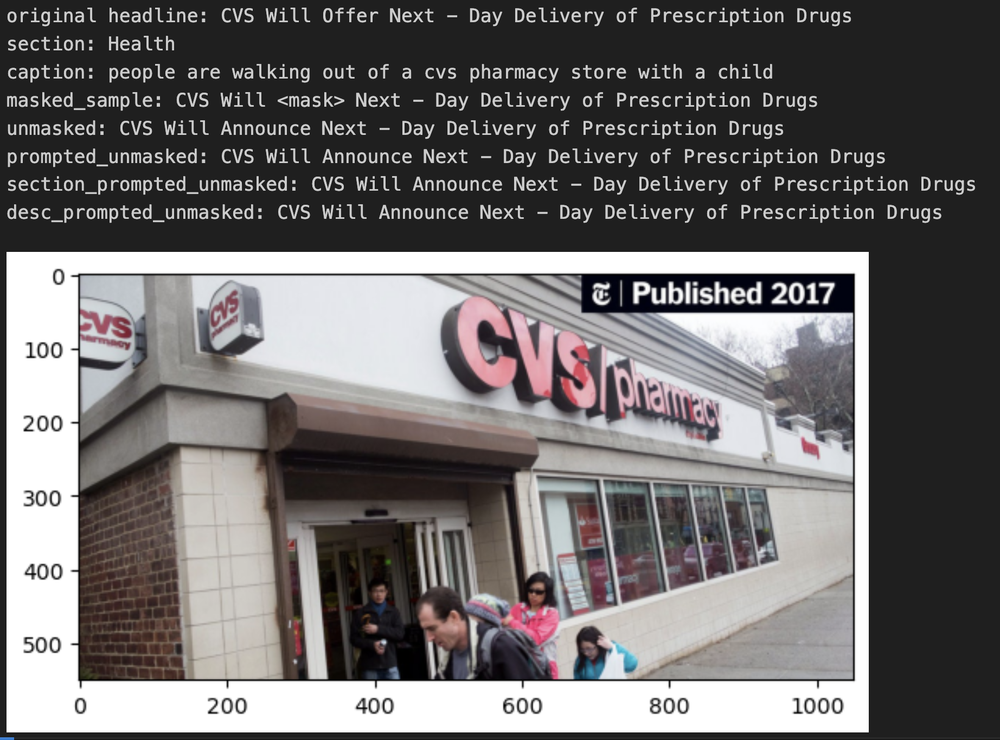

# News UnMasked
Huggingface challenge --> https://huggingface.co/spaces/competitions/news-unmasked

## Installation

Use the following command to setup the environment:

`$ conda env create --file environment_{cpu/gpu}.yaml`

To dump all the new changes in env file:

`$ conda env export --no-builds --from-history > environment_{cpu/gpu}.yaml`

## Data

Data is available at: https://huggingface.co/datasets/generative-newsai/news-unmasked.
It contains 48988 train samples and 12247 validation samples.
Each sample contains the following fields:
- `image`: Image of the news article
- `headline`: Headline of the news article
- `section`: Section of the news article
- `image_id`: ID of the image

Train set example:
```json
{'image': <PIL.JpegImagePlugin.JpegImageFile image mode=RGB size=600x295>,
 'section': 'Education',
 'headline': "Role for Teachers Is Seen in Solving Schools ' Crises",
 'image_id': '000055fd-f997-57a0-b586-49eaf0d930fc'}
```

Test set example:
```json
{'image': <PIL.JpegImagePlugin.JpegImageFile image mode=RGB size=1050x549>,
 'section': 'Music',
 'headline': 'T Bone Burnett Wants to Make Music to Heal Shrinking Attention Spans',
 'image_id': '8a8498e7-55d4-5b29-9663-499815007177'}
```

5701 out of 12247 test headlines have `[MASK]` in them. The task specifies to predict the masked word.
The sample for submission follows:
<!-- table in markdown -->
| id | token_index | token |
| --- | --- | --- |
| 0006d6e6-a16f-5d69-a307-0e7e1b659075 | 5 | regular |
| 006116e2-ec59-5b9d-af70-eeaf8af4a411 | 8 | new |
| 006116e2-ec59-5b9d-af70-eeaf8af4a411 | 9 | little |

Example of headline with no mask in test set:

`Audible Creates $ 5 Million Fund for Emerging Playwrights`

Unique sections in test and train set: 24

### Sample count per section
<!-- Include image -->


### Headline length by section


### Sample Images


Image sizes are varying. The images are varying from approx 600x249 to 1050x549 (Dimensions are not min and max).

## Approach

### Image Caption + Mask Filling
- Use image captioning to generate a caption for the image.
- Use the caption as the context and the headline as the masked text.
- Use a mask filling model to predict the masked word.

Sample examples using `BLIP-large (caption) + distilroberta-base (mask filling)` pipeline:

| Image | Improved |
| --- | --- |
|  | Yes |
|  | No |

rouge1 scores for initial 100 samples from validation set:

| Prompted | rouge1-mean | rouge1-std |
| --- | --- | --- |
| Yes | 0.91905105 | 0.06257464 |
| No | 0.91925573 | 0.062571734 |

7% of inital 100 samples from validation set showed improvement in rouge1 score with prompted approach. In this approach we are using image caption as the context and the headline as the masked text.

Test Set cosine score on leaderboard: 20.2987
Accuracy on validation set: 28.20%

### One Word Section + Descriptive Section
Tried adding one word section as prefix to the caption and in another experiment tried adding the descriptive section as prefix to the caption. The results were not conclusive. The performance changes based on what was masked.

| Image | Observation |
| --- | --- |
|  | unmasked == prompted > sample_prompted == desc_sample_prompted |
|  | sample_prompted == desc_sample_prompted > unmasked == prompted |

### BLIP-large
#### BLIP Conditional Generation
Passing the image and masked headline as the context to the model. Some limitations, using BLIPForConditionalGeneration, which is trained to complete a prompt and not MLM.

Baseline cosine similarity accuracy on validation set: 13.13%

Training accuracy seems to increase but very low impact on validation accuracy.

##### Optimizations
- Using torch amp
    - Saw quite an improvement in training speed and convergence.

#### BLIP VQA
On Abhishek's advice trying VQA with a prompt:
`Fill the [MASK] label in the following news headline from section {section} : {masked_headline}`

Baseline cosine similarity accuracy on validation set: 0.15%

Tried training on a smaller set (100 samples). The model performance seems to go down and never recover.

## Masked training Dataset
I have masked and created the training dataset for consistency
Download using command:
`!gdown https://drive.google.com/uc?id=1OUj56f7gX7_C-xQE6YkVBpJICVNcDsNl`

## Readings
Could be useful stuff:
- Intro Blog for Vision-Language Models: https://huggingface.co/blog/vision_language_pretraining
- Survey paper on Vision-Language Models: https://arxiv.org/abs/2210.09263
- Another survey paper on Vision-Language Models: https://www.semanticscholar.org/reader/04248a087a834af24bfe001c9fc9ea28dab63c26

## Possible Directions
- Can mask only the adjectives in training dataset.
- A lot of images have a celebrity, identifying the celebrity might help in predicting the masked word.
    - Q: Do they mask only adjectives or proper nouns as well?
- Video-Language Multi-Modal Models
- Pre-Train Image Caption to generate headlines
- Use section somehow in generating the headlines

## Git Commits
Jupyter Notebook output getting cleaned as per: https://medium.com/somosfit/version-control-on-jupyter-notebooks-6b67a0cf12a3

## Notebook link
https://colab.research.google.com/drive/1jFHRYrEsIodEef17plDFxjN-pAlYZOdJ?usp=sharing
